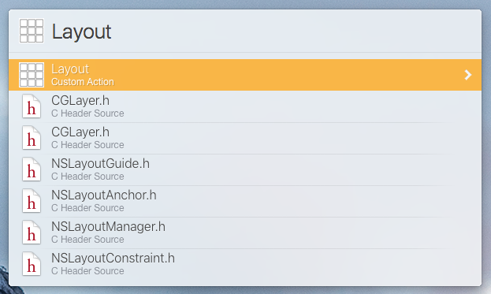
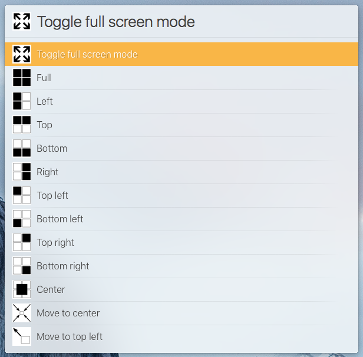

# Layout Action for LaunchBar 6

This action is a port of [alfred2-layout](https://github.com/untoldwind/alfred2-layout) by [untoldwind](https://github.com/untoldwind).

## Installation

## Description

A suite of custom actions for *moving* and *zooming* windows. Very much like [moom](https://manytricks.com/moom/) or [spectacle](https://www.spectacleapp.com).

- `Full` = Maximize
- `Left`, `Right`, `Top`, `Bottom` = Halves of screen
- `Top Left`, `Top Right`, `Bottom Left`, `Bottom Right` = Quaters of screen
- `Center` = Center of screen (with 10% border)
- `Toggle full screen mode` = Toggle full screen mode of active window (if possible)
- `Move to center` = Move window to center of screen (no resize)
- `Move to top left`, `Move to top right`, `Move to bottom left`, `Move to bottom right` = Move window to edges of screen (no resize)
- `Grow ...`, `Shrink ...` = resize window by 1/6 of screen size with sticky screen edges
- `Resize to ...` = resize window to video resulution (e.g. screencasts)

## Screen Shots

